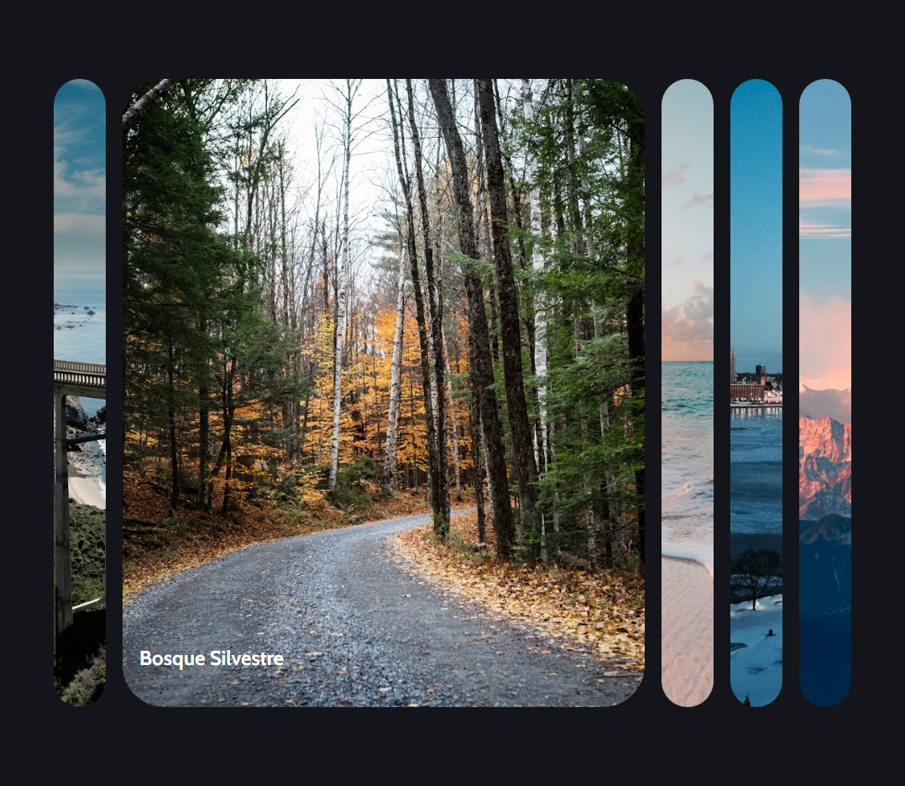

# Expanding Cards



## 🧞 CODE

### HTML
```html
<div class="container">
    <div class="panel" style="background-image: url(https://images.unsplash.com/photo-1558979158-65a1eaa08691?ixlib=rb-1.2.1&ixid=eyJhcHBfaWQiOjEyMDd9&auto=format&fit=crop&w=1350&q=80);">
        <h3>Explorar El Mundo</h3>
    </div>
    <div class="panel" style="background-image: url(https://images.unsplash.com/photo-1572276596237-5db2c3e16c5d?ixlib=rb-1.2.1&ixid=eyJhcHBfaWQiOjEyMDd9&auto=format&fit=crop&w=1350&q=80)">
        <h3>Bosque Silvestre</h3>
    </div>
    <div class="panel" style="background-image: url(https://images.unsplash.com/photo-1507525428034-b723cf961d3e?ixlib=rb-1.2.1&ixid=eyJhcHBfaWQiOjEyMDd9&auto=format&fit=crop&w=1353&q=80)">
        <h3>Playa Soleada</h3>
    </div>
    <div class="panel" style="background-image: url(https://images.unsplash.com/photo-1551009175-8a68da93d5f9?ixlib=rb-1.2.1&ixid=eyJhcHBfaWQiOjEyMDd9&auto=format&fit=crop&w=1351&q=80)">
        <h3>Ciudad En Invierno</h3>
    </div>
    <div class="panel" style="background-image: url(https://images.unsplash.com/photo-1549880338-65ddcdfd017b?ixlib=rb-1.2.1&ixid=eyJhcHBfaWQiOjEyMDd9&auto=format&fit=crop&w=1350&q=80)">
        <h3>Montañas - Nubes</h3>
    </div>
</div>
```
### JavaScript
```javascript
    const panels = document.querySelectorAll('.panel')

    panels.forEach(panel => {
        panel.addEventListener('click', ()=>{
            removeActiveClasses()
            panel.classList.add('active')
        })
    })

    function removeActiveClasses() {
        panels.forEach(panel => {
            panel.classList.remove('active')
        })
    }
```

### CSS
```css
    .container {
        display: flex;
        width: 90vw;
    }
    .container .panel {
        height: 80vh;
        border-radius: 50px;
        color:#fff;
        cursor: pointer;
        flex: 0.5;
        margin: 10px;
        position: relative;
        background-position: center;
        background-repeat: no-repeat;
        background-size: cover;
        transition: flex 0.7s ease-in;
    }

    .container .panel h3{
        font-size: 24px;
        position: absolute;
        bottom: 20px;
        left: 20px;
        margin 0;
        opacity: 0;
    }

    .container .panel.active {
        flex: 5;
    }

    .container .panel.active h3 {
        opacity: 1;
        transition: opacity 0.3s ease-in 0.4s;
    }
```
## 👀 Want to learn more? | ASTRO

Feel free to check [our documentation](https://docs.astro.build) or jump into our [Discord server](https://astro.build/chat).
